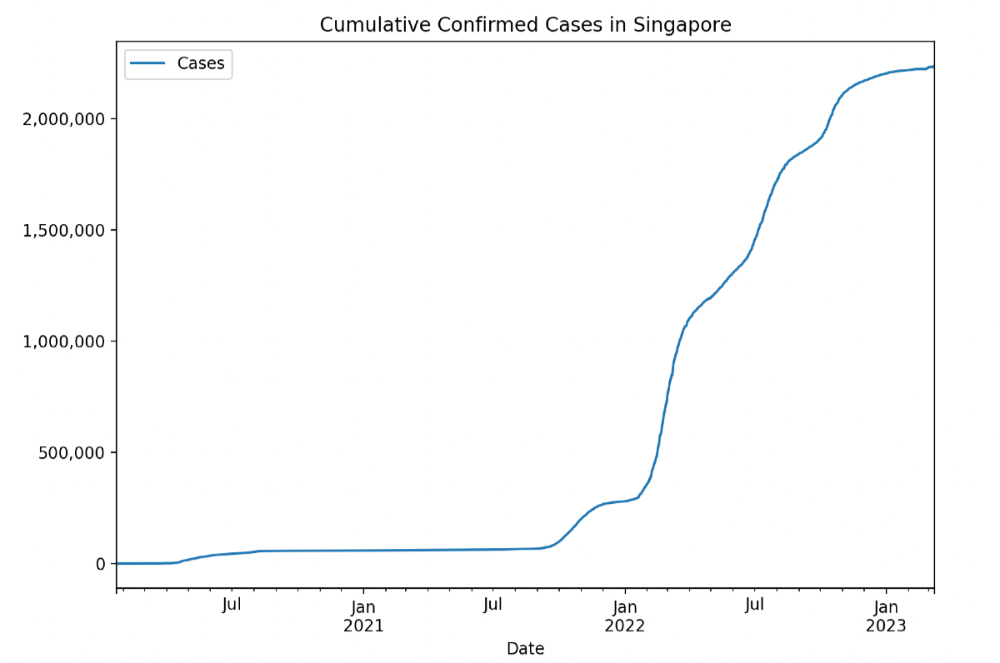

# Charts & APIs of COVID19 Cases

## Overview

This section shows displaying chart using `matplotlib` python library. 

In this example, the chart show the cumulative number of confirmed cases of COVID19 in Singapore. The source of data is retrieved from API https://covid19api.com.

## How to run

### 1. Install requirements

Ensure that python environment with pip is available. Run `pip install -r requirements.txt` to install the dependencies.

### 2. Run the python script

Run `python singapore_covid_cases.py` to plot the chart.

### 3. Chart is generated

Sample output chart screenshot is shown below.

