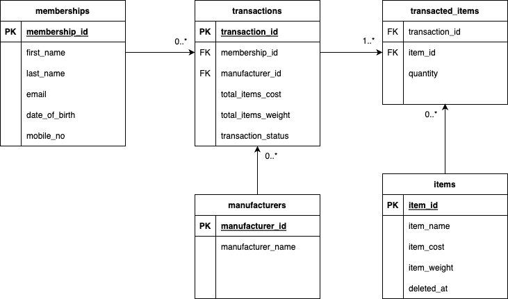

# Databases for E-commerce Transactions

## Overview

This section showcases using docker to initialise PostgreSQL instance with database tables suitable for e-commerce transactions.

The entity-relationship diagram is shown below.



## How to run

### 1. Install docker

Ensure that docker is installed in the environment.

### 2. Run docker compose

Run `docker compose up` to download and bring up PostgreSQL instance based on `docker-compose.yml` file.

Tables will be initialised based on `init.sql` file.

### 3. Run sample queries

Below are some samples queries that can be run.

Which are the top 10 members by spending?

```
SELECT m.membership_id, m.first_name, m.last_name, t.total_items_cost_by_member
FROM memberships m
JOIN (
    SELECT membership_id, SUM(total_items_cost) AS total_items_cost_by_member
    FROM transactions
    GROUP BY membership_id
    ORDER BY total_items_cost_by_member DESC
    LIMIT 10
) t
ON m.membership_id = t.membership_id;
```

Which are the top 3 items that are frequently bought by members?

```
SELECT ti.item_id, i.item_name, COUNT(t.transaction_id) as frequency
FROM transactions t
JOIN transacted_items ti ON t.transaction_id = ti.transaction_id
JOIN items i ON ti.item_id = i.item_id
GROUP BY ti.item_id, i.item_name
ORDER BY frequency DESC
LIMIT 3;
```