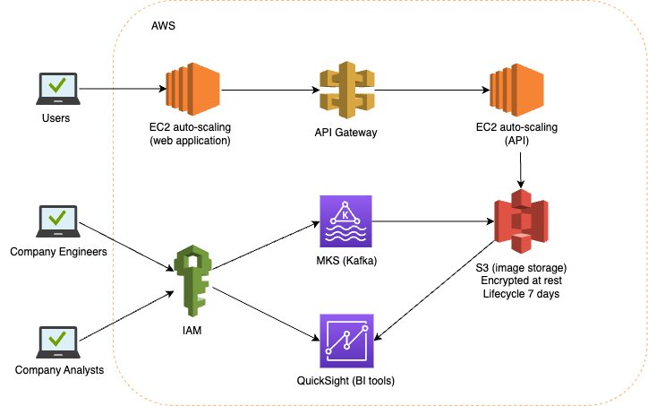

# System Design

## Design 1

Given the database design in folder `databases` for e-commerce transactions, if the database were to be used by several teams within the company to track the orders of members, ideally an internal web admin portal should be developed, especially for Logistics and Sales teams who need to update the tables for completed transactions and new items. This would allow extra validation and ensure that there is less likely a mistake made in executing SQL queries.

However, if there's a resource constraint in developing a web admin portal and the teams are trained in SQL queries, a web interface such as pgAdmin can be installed. Ideally the pgAdmin interface should only be accessible when connected via company VPN or whitelisted IP addresses. Each relevant persons in Logistics, Analytics, and Sales teams will be given their own database user account with restricted permissions. 

Logistics team should get read access to all tables, insert and update privelege to `transactions`, `transacted_items`, and `items` tables to allow them to update completed transactions.

Analytics team should get read access to all tables to allow them to perform analysis on the sales and memebership status.

Sales team should get insert and update privelege to `items` table to update new and old items. Ideally they should remove old items from database by soft-deleting (update `deleted_at` field) since the items still need to be referenced by past transactions.

If it's not necessary for their tasks, `mobile_no` and `email` should be excluded from read access of `memberships` table due to privacy reasons.

Stored procedures can be prepared to allow the teams to update the tables more easily.

## Design 2

Given a company whose main business is in processing images, the below system architecture diagram to depict the flow of its data pipeline.

This design is based on system hosted in AWS cloud. The web application which allows users to upload images is hosted on an auto-scaling EC2 cluster. The API to upload images is hosted on another auto-scaling EC2 cluster which is fronted by an API gateway for additional security and monitoring. The gateway can also acts a single entry point for other future APIs.

The images are then stored in S3 buckets, which are configured to be encrypted at rest, and has a lifecycle policy that deletes the files older than 7 days.

The company's engineers and analysts will access the AWS resources via IAM accounts with configured policies that only give them permission to relevant resources. The engineers will have access to manage the Kafka stream to upload images to the same S3 cloud environment. The analysts will access to AWS QuickSight BI tools to perform analysis on the images and its metadata. These access can be further restricted by IP addresses.

